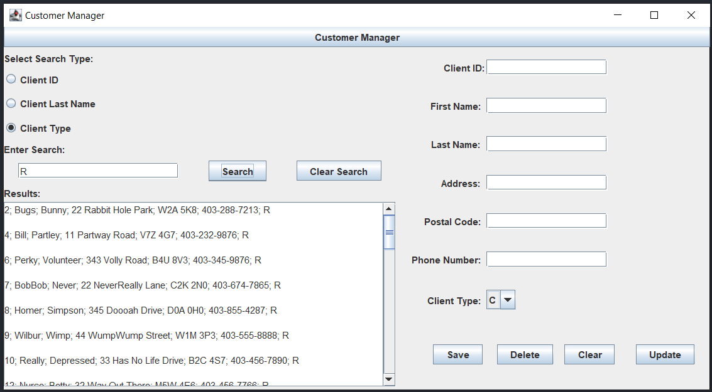

# Tool-Shop-Project

### Authors: Myles Borthwick, Ken Loughery

## About
The purpose of this project was to develop a Java application that could be used to manage and display both client and tool information from a MySQL database. 
The Split folder is an organized version copy of the application that is seperated by Server and Client.

### Screenshots

## How To Run
For the application to work correctly, an sql database must be set up on the device. The files in 'managers' must be changed to match your database credentials etc. Once set up, run the ServerMain controller to run the server. Next open the client application by running ClientSocket.java. If done correctly the tool shop GUI can be used to view and update the SQL database.
